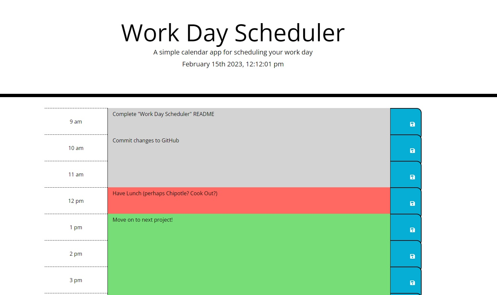

# Work Day Scheduler

## Description

This is a simple calendar app for scheduling your workday. jQuery is used to store information in local storage & to automatically load that info when the page is refreshed. 

## Access

[Work Day Scheduler](https://ghostofthemill.github.io/addguy-does-what/)

## Creator

GhostoftheMill
 
GitHub: https://github.com/GhostoftheMill